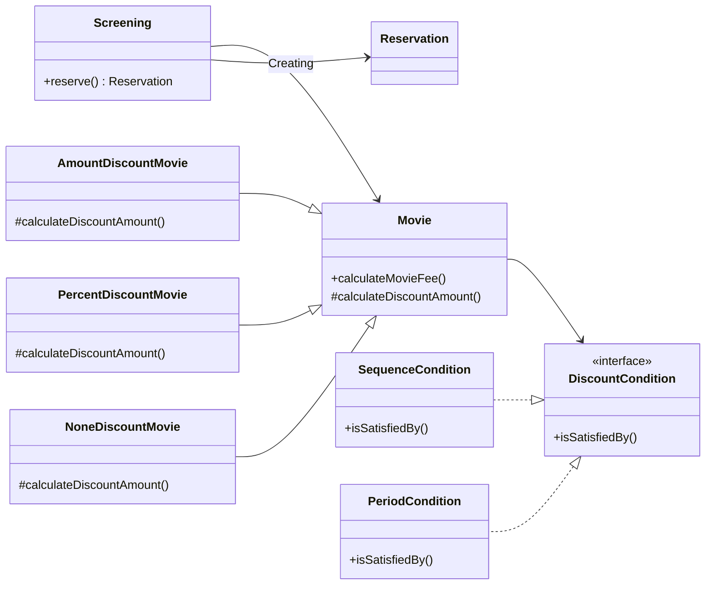

```mermaid
classDiagram
  direction RL
  Movie <-- Screening
  DiscountCondition <-- Movie
  Reservation <-- Screening : Creating
  DiscountCondition <|.. SequenceCondition
  DiscountCondition <|.. PeriodCondition  
  
  Movie <|-- AmountDiscountMovie
  Movie <|-- PercentDiscountMovie
  Movie <|-- NoneDiscountMovie
  
  class Screening{
  +reserve() Reservation
  }
  class Movie{
  +calculateMovieFee()
  #calculateDiscountAmount()
  }
  class DiscountCondition{
  <<interface>>
  +isSatisfiedBy()
  }
  class AmountDiscountMovie{
  #calculateDiscountAmount()
  }
  class PercentDiscountMovie{
  #calculateDiscountAmount()
  }
  class NoneDiscountMovie{
  #calculateDiscountAmount()
  }
  class SequenceCondition{
  +isSatisfiedBy()
  }
  class PeriodCondition{
  +isSatisfiedBy()
  }
  class Reservation{
  
  }
```
